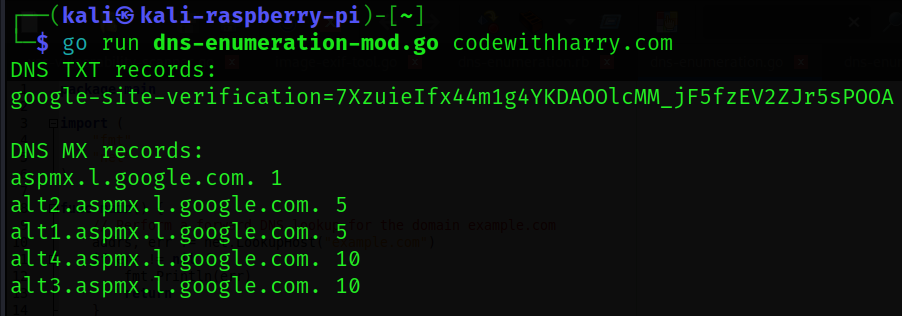

<h1><b>DNS Enumeration In Go</b></h1>
<h1><b>What Is DNS Enumeration?</b></h1>
<h2><i>DNS enumeration is the process of locating all the DNS servers and their corresponding records for an organization. DNS enumeration will yield usernames, computer names, and IP addresses of potential target systems.</h1></i>

#
  </a>

#
<h2><b> 😇 Author: Sumalya Chatterjee </b></h2>

#
<h1><b>❤️ Don't Copy, Do Fork 😊</b></h1>

#

<h1><b>Run The Tool 👇</b></h1>



#

<h1><b>Git Installation </h1></b>

```
# Install Git
sudo apt install git

# Install Go
sudo apt install golang

# Git Clone
git clone https://github.com/R3DHULK/dns-enumeration-in-go

# Change Directory
cd dns-enumeration-in-go

# Run This Tool To Find Subdomains On Target Networks
go run dns-enumeration-mod.go <target domain name>

```
#
<h2><b><i> Show Support 👇👇👇</b></i> </h2>
<a href="https://www.buymeacoffee.com/r3dhulk"> </a><br><br>

